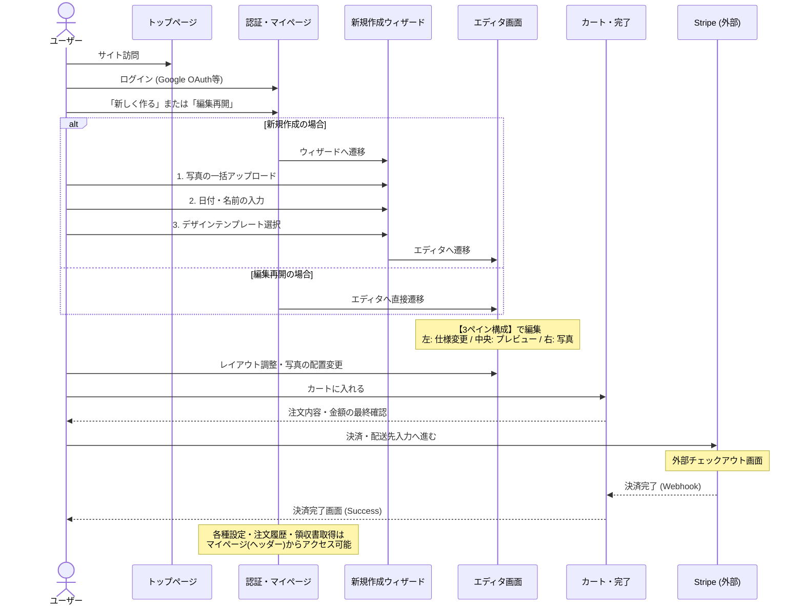

# [MVP] 初版ユーザーフローと画面一覧

MVPの目標である「写真データを手軽にアップロードし、高水準なアルバムを作成・注文できる体験」を実現するための、初版ユーザーフローと画面一覧です。

## 1. ユーザーフローの全体像

ユーザーがサイトを訪問してから、アルバムを作成し、購入を完了するまでのフローを以下のステップと定義します。

1. **認知・訪問**: トップページ（LP）でサービスの価値・世界観を知る
2. **会員登録**: Google OAuth等でログイン（アカウント作成）
3. **アルバム作成の開始**: ダッシュボード（初回はそのまま）から新規アルバムの作成ウィザードをスタート
4. **写真のアップロード (Wizard Step 1)**: アルバムに使用する写真データをドラッグ＆ドロップまたはQRコードでアップロードする
5. **アルバム情報の入力 (Wizard Step 2)**: アルバムに印字する日付や、お二人の名前を入力する
6. **デザインの選択 (Wizard Step 3)**: モダン、ポップなどのレイアウトの雰囲気（テンプレート）を選択する
7. **仕様変更・編集・プレビュー**: 3ペイン構成のエディタ画面で、ページ数・素材・レイアウトテンプレートの変更、写真の手動割り当て・自動配置などを行う。プレビューも同画面内で確認。
8. **注文内容確認（カート）**: 「カートに入れる」から進み、アルバム仕様や価格の確認、およびオプション商品（カバー等）の選択を行う
9. **決済（外部遷移）**: 次へ進むとStripe Checkoutの画面へ遷移。ここで配送先情報の入力とカード決済をまとめて行う
10. **完了**: 決済が成功すると自社サイトの購入完了画面へ戻る。後日製本データが工場へ送られ手元に届く

---

## 2. 必要な画面一覧と各画面の役割

Next.js (App Router) でのパス構成を意識して画面を定義します。

| 画面の名称 | 想定パス | 役割 |
|---|---|---|
| **トップページ (LP)** | `/` | サービスのコンセプト訴求。「アルバムを作る」アクションへの入り口。 |
| **ログイン画面** | `/login` | ユーザー認証 (Google OAuth対応想定)。 |
| **マイページ** | `/dashboard` | 作成履歴（過去のアルバム）の表示。編集途中のアルバムが存在する場合は、再開を促すモーダルを表示し直接エディタへ遷移可能。 |
| **アルバム作成：アップロード** | `/album/[id]/upload` | ウィザードStep1。発行された一意のアルバムIDに対して写真データを一括アップロードする。 |
| **アルバム作成：情報入力** | `/album/[id]/info` | ウィザードStep2。日付や名前の入力。 |
| **アルバム作成：デザイン選択** | `/album/[id]/design` | ウィザードStep3。レイアウト（モダン・ポップ等）の選択。ここから直接エディタ画面へ遷移。 |
| **エディタ（編集）画面** | `/album/[id]/edit` | 3ペイン構成のメイン作業画面。 ・**左パネル**: ページ数・表紙素材・カラーの変更、およびレイアウトテンプレートの変更 ・**中央**: 見開き確認、プレビュー、カートに入れる ・**右パネル**: 写真追加（OSダイアログ）、アップロード済み写真一覧、自動配置。 ※アップロード完了時やエラー時（解像度不足など）は画面中央上部にトースト通知を表示。 |
| **注文内容確認（カート）画面** | `/cart` | 選択した仕様と購入金額の確認。アルバムカバーなどを「カートに追加」できる領域が付随。ここから決済プロバイダへ遷移。 |
| **決済（Stripe Checkout）** | (外部ドメイン `checkout.stripe.com`) | Stripeのホステッド決済ページ。クレジットカード情報および**配送先住所や連絡先**の入力と決済実行を行う。 |
| **利用規約・プライバシーポリシー** | `/terms` , `/privacy` | サービスの利用規約およびプライバシーポリシーを表示する静的ページ。ログイン画面やフッター等から遷移。 |
| **アカウント設定画面** | `/account/settings` | 左サイドバー（アカウント・注文履歴・通知）を持つレイアウト。ユーザー情報の変更や退会手続きなどを行う。 |
| **注文履歴画面** | `/account/orders` | 左サイドバーを持つ画面。過去の注文と配送ステータスを一覧表示する。「請求書を確認する」からStripe外部画面へ遷移可能。 |
| **Stripe カスタマーポータル（領収書等）** | (外部ドメイン `billing.stripe.com` 等) | 注文履歴から遷移。Stripe側で発行された支払い処理の明細確認や、領収書（PDF）のダウンロードを行う。 |
| **問い合わせ画面** | `/contact` | ユーザーメニュー内。サポートへの問い合わせフォーム（または外部フォームへのリンク）。 |
| **ログアウト（アクション）** | `/api/auth/logout` 等 | セッションを破棄し、未ログイン向けの最初のトップページ（LP）へリダイレクトさせる。 |

---

## 3. 画面遷移の流れ (フロー図)

